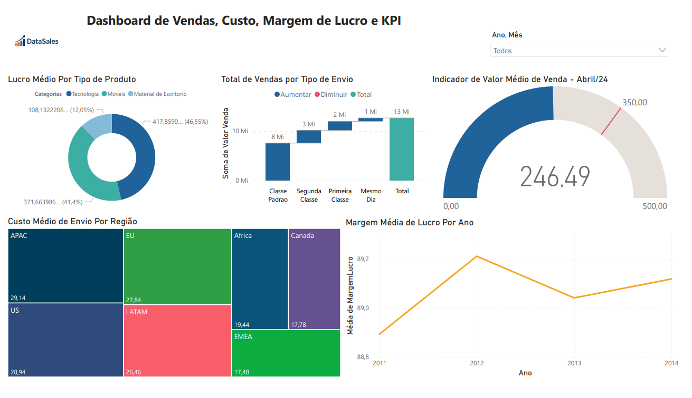

# Painéis no Power BI

Este repositório contém os dashboards desenvolvidos durante meus estudos com o curso da Data Science Academy.

---

## Projetos

### 1. Dashboard de Vendas, Custos e Lucro

Esse dashboard responde perguntas de negócio como:
- Qual categoria teve maior lucro?
- Qual modo de envio foi mais usado?
- A empresa bateu a meta de vendas em abril/2014?

Gráficos usados:
- Cascata
- Treemap
- KPI
- Linha
- Rosquinha

